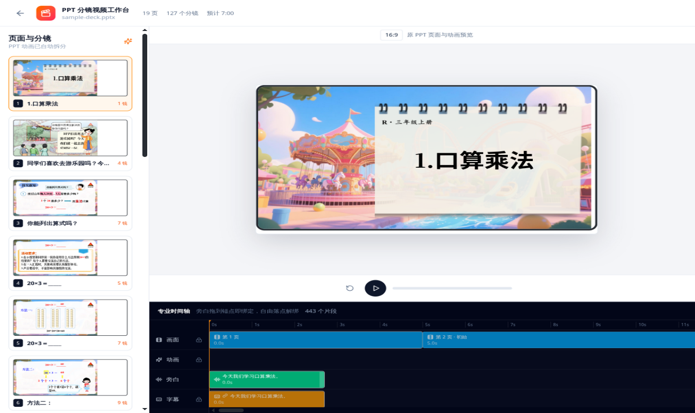
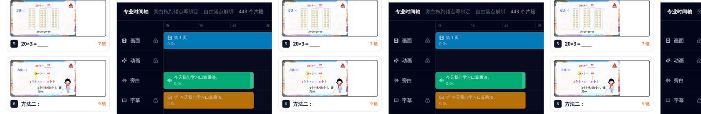
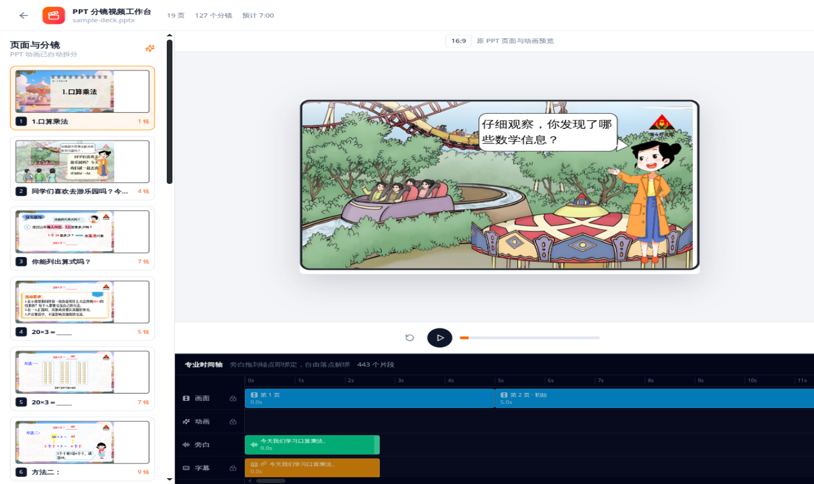

# pptx-storyboard · 分镜成片

**把 PowerPoint 原生动画变成带讲解的视频。**

导入一份 `.pptx`，系统解析每一页的原生动画时间戳，自动切成分镜，
生成讲解词，神经语音配音，多轨时间轴上精修音画绑定，最后用 GPU
流水线渲染出带字幕的 MP4。全程本地运行，不依赖云端。

> 当前版本 `storyboard-video-v0.2.0` · 实测基线：19 页课件 → 127 分镜 →
> 6 分 56 秒 1080p 成片，渲染流水线 91 秒



---

## 核心能力

### 1. 原生动画时间戳捕捉

读取 slide XML 的 `p:timing` 时间节点树，按 `clickEffect / withEffect /
afterEffect` 三种触发语义编译成点击组，组内每一步保留 PowerPoint 的
**原生毫秒**（`delayMs` / `durationMs`），不做任何缩放。进入、退出、
强调、运动路径四类预设全支持。

### 2. 自动分镜

每个点击组自动切成一个分镜，附带"组前 / 组中 / 组稳定后"三个画面
状态快照。静音分镜按退出/揭示类分级压缩节奏，避免无讲解死气。

### 3. 讲稿与神经配音

确定性讲稿规划器：只讲解"当前动画组新增的内容"，退出与无文本动画
自动静音，规则化消除重复话术。配音走 Edge 神经语音（免凭据）或腾讯
云精品音色，4 路并行合成；DeepSeek 润色为可选，不配置密钥也能跑。

### 4. 多轨时间轴与点击即绑定

画面 / 动画 / 旁白 / 字幕四轨时间轴：



- **点击动画卡即绑定**：旁白跟着那个动画一起出现，再点一次解除；
- 8px 磁吸锚点、拖拽改时间、后续片段自动顺延（ripple）；
- 真实播放头：空格播放、方向键逐帧、时间尺拖拽定位；
- 绑定是显式数据模型（`TimelineBinding`），改文案只重算配音时长，
  锚点永不被破坏，导出 manifest 附带绑定回执可追溯。



### 5. GPU 渲染流水线

客户端低内存捕获每个分镜的关键状态帧 → 8 路 NVENC 并行编码分片 →
拼接、按毫秒锚点混音、生成 SRT → `ffprobe` 完整解码 + SHA-256 验收。
19 页课件从点击"生成视频"到拿片约 2 分钟（含状态捕获）。


---

## 快速开始

环境要求：[Bun](https://bun.sh) 1.x、FFmpeg（可选 NVENC 显卡加速）、
可访问 Edge TTS 公共端点的网络。

```bash
bun install

STORYBOARD_TTS_EDGE=1 STORYBOARD_GPU_ENCODING=1 \
STORYBOARD_RENDER_CONCURRENCY=8 STORYBOARD_TTS_CONCURRENCY=4 \
bun run demo -- --host 127.0.0.1 --port 4173
```

打开 `http://127.0.0.1:4173` → 导入 PPTX → 顶部"分镜视频"→ 检查讲稿
与时间轴 →"生成视频"。成片与 SRT 自动下载，任务回执在
`/tmp/pptx-storyboard-jobs-v1/<job-id>/`。

---

## 架构一览

```text
slide XML <p:timing> 树
  → core 解析为 PptxNativeAnimation[]（逐动画原生毫秒）
  → shared TimelineEngine 编译点击组（onClick 开组，with/after 级联）
  → 固定逻辑时钟展开（每组：绝对时间 + 状态快照）
  → 分镜模型（事件级 startOffsetMs / durationMs）
  → 全局四轨时间轴（绝对 startMs + TimelineBinding）
  → 关键状态帧 PNG + manifest（时间戳合同）
  → NVENC 分片并行 → 拼接混音 → SHA-256 验收
```

| 目录                     | 内容                                                     |
| ------------------------ | -------------------------------------------------------- |
| `packages/core`          | PPTX 解析 / 序列化内核（含 `p:timing` 解析服务）         |
| `packages/shared`        | 动画播放引擎、时间轴编译、渲染逻辑（框架无关）           |
| `packages/react`         | 查看器与分镜工作台 UI（`viewer/components/storyboard/`） |
| `demos/demo-react`       | 演示应用与 `storyboard-server/` 视频流水线               |
| `docs/storyboard-video/` | 工程手册、交接文档、CHANGELOG、版本                      |

## 文档

- [工程手册](docs/storyboard-video/README.zh-CN.md)：启动、验收命令、
  自动化与人工边界、回滚
- [技术交接文档](docs/storyboard-video/HANDOVER.zh-CN.md)：**原生动画
  时间戳捕捉的完整实现链路**（七步数据流，逐步到文件与函数）
- [变更日志](docs/storyboard-video/CHANGELOG.md) 与
  [绑定交互审计](docs/03-新需求与规划/2026-09-10-PPT动画绑定交互点对点功能审计.md)

## 测试

```bash
cd packages/react && bunx vitest run src/viewer/components/storyboard  # 26 文件 332 测试
bun run typecheck
bunx oxlint --deny-warnings packages/react/src/viewer/components/storyboard/
```

全仓库 419 个测试文件 / 7073 项测试。版本基线用 annotated tag
（`storyboard-video-v0.2.0`）管理，各包独立版本独立发布。

## 许可

Apache-2.0。本仓库基于 [ChristopherVR/pptx-viewer](https://github.com/ChristopherVR/pptx-viewer)
构建，衍生作品按原许可证保留其署名与许可声明；分镜视频系统
（`docs/storyboard-video/`、`demos/demo-react/storyboard-server/`、
`packages/*/storyboard` 相关模块）为独立开发的新增部分。
